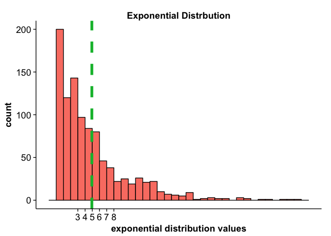
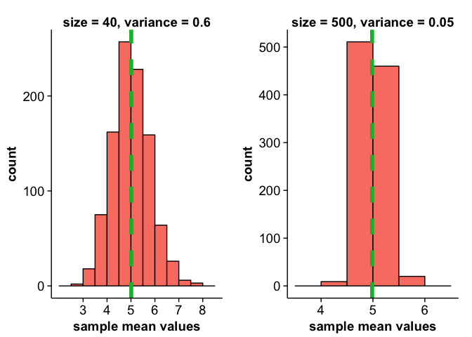
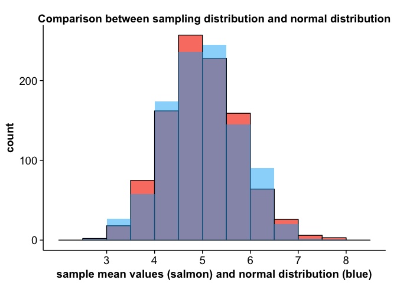

# Simulation Exercise and Statistical Inference
Author: Kwokmun Lee  
Report created: 21 Oct 2016 18:18

## Overview

In this project we will investigate the exponential distribution in R and compare it with the Central Limit Theorem. The exponential distribution can be simulated in R with rexp(n, lambda) where lambda is the rate parameter. The mean of exponential distribution is 1/lambda and the standard deviation is also 1/lambda. Set lambda = 0.2 for all of the simulations. We will investigate the distribution of averages of 40 exponentials. Note that you will need to do a thousand simulations.

Illustrate via simulation and associated explanatory text the properties of the distribution of the mean of 40 exponentials.  You should:

1. Show the sample mean and compare it to the theoretical mean of the distribution.
2. Show how variable the sample is (via variance) and compare it to the theoretical variance of the distribution.
3. Show that the distribution is approximately normal.

### Exploring Sample Mean and Theoretical Mean

We will be using ggplot to illustrate the exponentional distributions. Let's load the ggplot package.


```r
library(ggplot2)
library(grid)
library(gridExtra)
library(cowplot)
```

```
## 
## Attaching package: 'cowplot'
## 
## The following object is masked from 'package:ggplot2':
## 
##     ggsave
```

Let's set the sample size = 40 and number of simulations = 1000. The rate (lambda) we will be using is 0.2.


```r
lambda <- 0.2
size <- 40
nosim <- 1000
```

Let's take a look at the population distribution of 1000 values in the exponential distribution with lambda = 0.2.


```r
set.seed(35)
exp <- rexp(1000, lambda)
population <- as.data.frame(exp)
ggplot(data = population, aes(x = exp)) + geom_histogram(colour = "black", fill = "salmon", binwidth = 1) + scale_x_continuous(breaks = 3:8) + geom_vline(aes(xintercept = mean(population$exp)), colour = "#00BA38", linetype = "dashed", size = 2) + ggtitle("Exponential Distrbution") + xlab("exponential distribution values")
```

 

Notice that the mean for this distribution is 4.86, which is more or less equal to the theoretical mean of 1/lambda = 1/0.2 = 5.


```r
mean(population$exp)
```

```
## [1] 4.941847
```

Now, let's simulate the sampling distribution of the means of sample size 40 and repeating the sampling 1000 times. This is how the sampling distribution looks like.


```r
set.seed(123)
exp.mean <- replicate(nosim, mean(rexp(size, lambda)))
sample.mean <- as.data.frame(exp.mean)
ggplot(data = sample.mean, aes(x = exp.mean)) + geom_histogram(colour = "black", fill = "salmon", binwidth = 0.5) + scale_x_continuous(breaks = 3:8) + geom_vline(aes(xintercept = mean(sample.mean$exp)), colour = "#00BA38", linetype = "dashed", size = 2) + ggtitle("Sampling Distrbution of the Means (sample size = 40, var = 0.6)") + xlab("sample mean values")
```

 

Notice that the sample mean is 5.01, which is the approximately the theoretical mean calculated earlier.


```r
mean(sample.mean$exp.mean)
```

```
## [1] 5.011911
```

This proves one of the properties of the Central Limit Theorem which states that if the sample is large enough, the sample mean is approximately the mean of the population (theoretical mean).

### Exploring Variance of the Sampling Distribution of the Means and Theoretical Variance

Let's look at the theoretical variance. We know that the standard deviation of an exponential distribution is 1/lambda. Given that our lambda is 0.2, the theoretical variance is 25.


```r
1/0.2^2
```

```
## [1] 25
```

Let's confirm that this is true by looking at our population distribution earlier:


```r
var(population$exp)
```

```
## [1] 25.54556
```

So far so good. Let's look at the variance of the sampling distribution of the means. We notice that it's 0.6.


```r
var(sample.mean$exp.mean)
```

```
## [1] 0.6004928
```

Not surprisingly, it isn't the same as the population variance of 25. The Central Limit Theorem says that the variance of the sampling distribution of the means is the population variance/sample size. Let's confirm this property:


```r
var(population$exp)/size
```

```
## [1] 0.6386391
```

Great. It is indeed the same as the variance of the sampling distribution of the means. Also notice that the larger the sample size, the smaller the sample variance will be because the sampling distribution of the means will centre more and more around the theoretical mean. Suppose that the sample size is now 500, this is how the sampling distribution look like:


```r
set.seed(155)
exp.mean500 <- replicate(nosim, mean(rexp(500, lambda)))
sample.mean500 <- as.data.frame(exp.mean500)
sample500.viz <- ggplot(data = sample.mean500, aes(x = exp.mean500)) + geom_histogram(colour = "black", fill = "salmon", binwidth = 0.5) + scale_x_continuous(breaks = 3:8) + geom_vline(aes(xintercept = mean(sample.mean500$exp)), colour = "#00BA38", linetype = "dashed", size = 2) + xlab("sample mean values") + ggtitle("size = 500, variance = 0.05")

sample40.viz <- ggplot(data = sample.mean, aes(x = exp.mean)) + geom_histogram(colour = "black", fill = "salmon", binwidth = 0.5) + scale_x_continuous(breaks = 3:8) + geom_vline(aes(xintercept = mean(sample.mean$exp)), colour = "#00BA38", linetype = "dashed", size = 2) + xlab("sample mean values") + ggtitle("size = 40, variance = 0.6")

plot_grid(sample40.viz, sample500.viz)
```

 

### Show that sampling distribution of the means is approximately normal

Let's simulate a sampling distribution of the means for a normal distribution with mean = 5 and standard deviation = sqrt(0.6) with 1000 simulations. If we overlay the normal distribution (in blue) over the exponential sampling distribution (in salmon colour), they approximate each other very well.


```r
set.seed(55)
norm <- rnorm(1000, 5, sd(sample.mean$exp.mean))
norm.pop <- as.data.frame(norm)

ggplot() + geom_histogram(data = sample.mean, aes(x = exp.mean), colour = "black", fill = "salmon", binwidth = 0.5) + scale_x_continuous(breaks = 3:8) + xlab("sample mean values (salmon) and normal distribution (blue)") + ggtitle("Comparison between sampling distribution and normal distribution") + geom_histogram(data = norm.pop, aes(x = norm), fill = "#00B0F6", binwidth = 0.5, alpha = 0.5)
```

 
