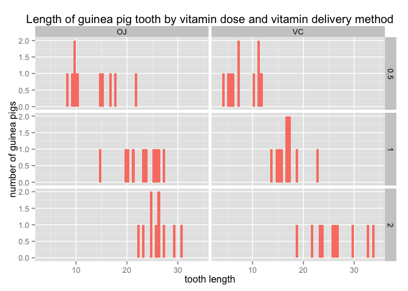

# Effects of Vitamin C Doses and Delivery Methods on Guinea Pig Tooth Growth

## Synopsis

This analysis explores tbe impact of different vitamin C doses and delivery methods on the length of guinea pig teeth.

## Load R packages

Let's use the ToothGrowth dataset and load the necessary packages


```r
attach(ToothGrowth)
data <- ToothGrowth
library(ggplot2)
library(dplyr)
```

```
## 
## Attaching package: 'dplyr'
## 
## The following objects are masked from 'package:stats':
## 
##     filter, lag
## 
## The following objects are masked from 'package:base':
## 
##     intersect, setdiff, setequal, union
```

## Exploratory Analysis and Visual Inspection

First, explore the tooth lengths by looking at vitamin doses (either 0.5mg, 1mg or 2mg) or vitamin delivery method (orange juice (OJ) or ascorbic acid(VC))


```r
ggplot(data = data, aes(x = len)) + geom_histogram(binwidth = 0.5, fill = "salmon") + facet_grid(dose ~ supp) + ggtitle("Length of guinea pig tooth by vitamin dose and vitamin delivery method") + xlab("tooth length") + ylab("number of guinea pigs")
```

 

Visually, it is pretty clear that when doses of vitamin C is higher, the tooth length is also higher. This is true for both delivery methods.

## Confirm with Inferential Analysis

Let's confirm with t-test. Create subsets of data to compare OJ & VC and to compare 0.5mg and 2.0mg doses.


```r
dose0.5 <- filter(data, dose == 0.5)
dose2.0 <- filter(data, dose == 2.0)
oj <- filter(data, supp == "OJ")
vc <- filter(data, supp == "VC")
```

Set x as tooth lengths as a result of 0.5mg dose and y as tooth lengths as a result of 2.0mg. Let's perform a t-test.


```r
t.test(dose0.5$len, dose2.0$len)
```

```
## 
## 	Welch Two Sample t-test
## 
## data:  dose0.5$len and dose2.0$len
## t = -11.799, df = 36.883, p-value = 4.398e-14
## alternative hypothesis: true difference in means is not equal to 0
## 95 percent confidence interval:
##  -18.15617 -12.83383
## sample estimates:
## mean of x mean of y 
##    10.605    26.100
```

Noticed that the mean tooth length for guinea pigs is 26.1 for the 2.0mg dose compared 10.6 for the 0.5mg dose.

Let's compare the OJ and VC groups:


```r
t.test(oj$len, vc$len)
```

```
## 
## 	Welch Two Sample t-test
## 
## data:  oj$len and vc$len
## t = 1.9153, df = 55.309, p-value = 0.06063
## alternative hypothesis: true difference in means is not equal to 0
## 95 percent confidence interval:
##  -0.1710156  7.5710156
## sample estimates:
## mean of x mean of y 
##  20.66333  16.96333
```

This confirms that guinea pigs tend to have longer tooth on average when given orange juice compared to ascorbic acid.
